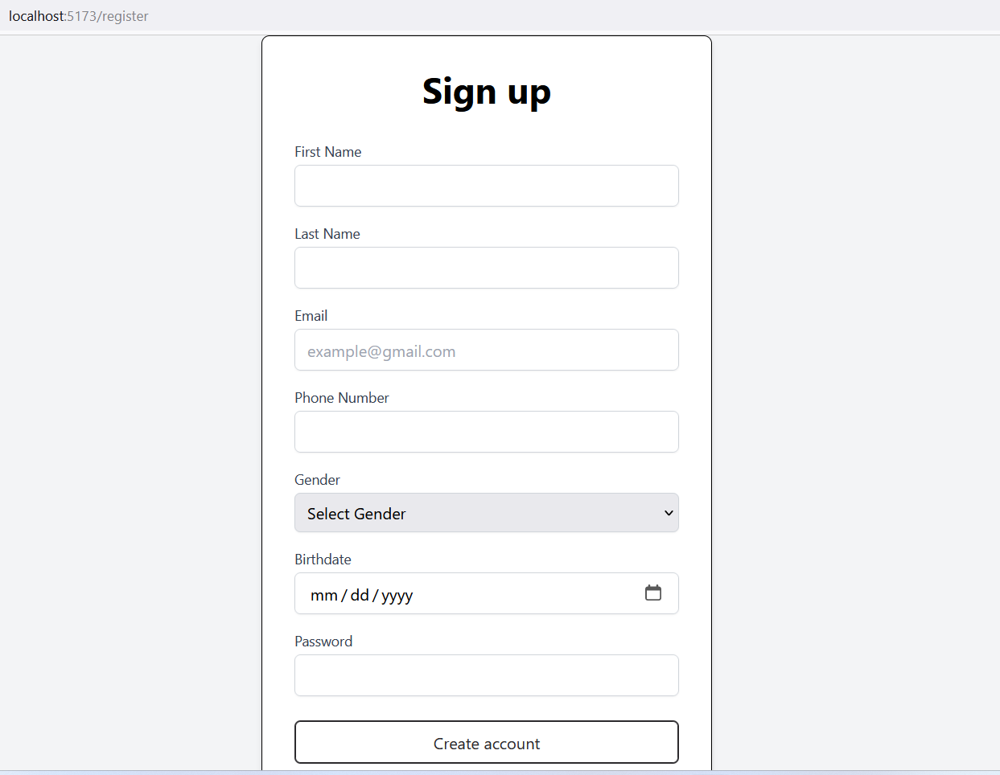

# QuizApp

## Overview

QuizApp is a web application designed to provide users with an interactive platform for participating in quizzes, creating their quizzes, and exploring a leaderboard. QuizApp offers a user-friendly and feature-rich experience.
  
### Video Demo

 [](https://youtu.be/IvPsstzbrSs) 

## Key Features

- **Quiz Participation:** Engage in quizzes covering various topics.
- **Quiz Creation:** Create personalized quizzes with customizable questions and answers.
- **Leaderboard:** Explore and view the top users based on community quiz points.


### Problems Solved

- Lack of a centralized platform for quiz participation and creation.
- Limited options for users to easily create and manage quizzes.

### Technologies Used

- **Frontend:** React.js for building interactive user interfaces.
- **Backend:** Node.js and Express for server-side logic.
- **Database:** MongoDB for storing user data and quiz information.

This project aims to provide a seamless and engaging experience for both quiz participants and creators, addressing the challenges associated with existing quiz platforms.


## Getting Started

### Prerequisites

Make sure you have Node.js and npm installed on your machine.

## Installation

1. Clone the repository:

    ```bash
    git clone https://github.com/Cpit405-QuizApp/QuizApp.git
    ```

2. Navigate to the `api` directory:

    ```bash
    cd QuizApp/api
    ```

3. Run the following command to install server-side dependencies:

    ```bash
    npm install
    ```

4. Return to the root of the project and navigate to the `client` directory:

    ```bash
    cd ..
    cd QuizApp/client
    ```

5. Run the following command to install client-side dependencies:

    ```bash
    npm install
    ```

6. Return to the `api` integrated terminal and start the server:

    ```bash
    nodemon index.js
    ```

    If you encounter an error, refer to this troubleshooting video.

7. Return to the `client` integrated terminal and start the client in development mode:

    ```bash
    npm run dev
    ```

    This will run the React app and open it in your default web browser.

## Usage

To use the QuizApp, follow these steps:

1. Open your web browser and navigate to [http://localhost:5173/](http://localhost:5173/).
2. Explore the platform, participate in quizzes, create your own quizzes, and engage with the interactive features.

Enjoy your quiz experience on QuizApp!


## API Functionality

The API encompasses various features, with a few key functionalities highlighted below:

### 1. User Authentication

- **Endpoint:** `/login`
- **Description:** Allows users to log in by providing valid credentials. Upon successful authentication, a JWT is issued and stored as a cookie for subsequent requests.

### 2. Quiz Management

- **Endpoints:**  `/myquizzes`,  `/communityquizzes`
- **Description:** Enables users to create quizzes, view their own quizzes, and explore community quizzes. Authentication is required for creating and accessing personal quizzes.

### 3. Leaderboard

- **Endpoint:** `/leaderboard`
- **Description:** Retrieves and displays a leaderboard based on users' quiz attempt scores. Provides insights into the top-performing users.

## Environment Configuration

Ensure to set the following environment variable:

  - Set the MongoDB connection URL in the `api/.env` file.
  - Replace `<username>`, `<password>`, `<cluster-url>`, and `<database>` with your actual MongoDB credentials.

This configuration ensures a seamless connection to the MongoDB database for storing user data and quiz information.

## Screenshots

Here are some screenshots to give you a visual overview of QuizApp's user interface and key features.

1. **Index Page:**
   - 

2. **Login Page:**
   - 

3. **Registeration Page:**
   - 
    
4. **Homepage:**
   - 

5. **Taking Quiz:**
   - 

6. **Quiz Details:**
   - 
